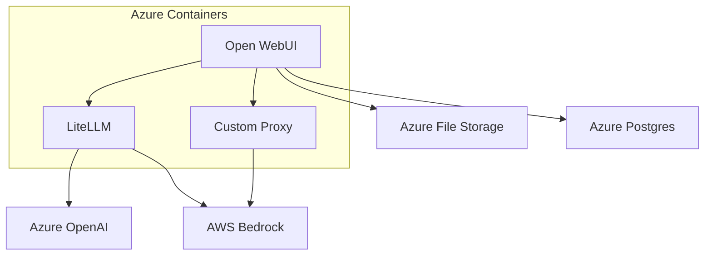

# Software Architecture

The architecture of Doc-Bot involves three separate containers: https://github.com/open-webui/open-webui, https://github.com/BerriAI/litellm, and a custom proxy server https://github.com/childmindresearch/doc-bot. Open WebUI serves as the frontend as well as basic backend processing for the chatbot. LiteLLM and the custom proxy server fulfill the same role: to provide an OpenAI-compliant adapter to other AI models. This is needed as Open WebUI sends out requests in OpenAI’s format. The custom proxy is there to cover models not supported well by LiteLLM; if LiteLLM supports all models we need, the custom proxy may be dropped. For persistence, the storage of Open WebUI is hosted in Azure File Storage and Postgres. 

# Cloud Deployment

The deployment consists of a container apps environment containing all aforementioned containers, a virtual network, a file storage for data persistence, and a key vault for secret management. These deployments were all done manually through the portal i.e. no template for deployment exists.

The LiteLLM container is a custom container based on the public LiteLLM container, but we built our `config.yaml` into this container. The proxy is also a custom container. The Open WebUI container is sourced directly from the Open WebUI repository. 

At the time of writing, the appropriate scaling of the containers is still unknown. Given the monolithic structure of Open WebUI, I’d expect that vertical scaling should be preferred. The other containers should be scalable in either direction.

